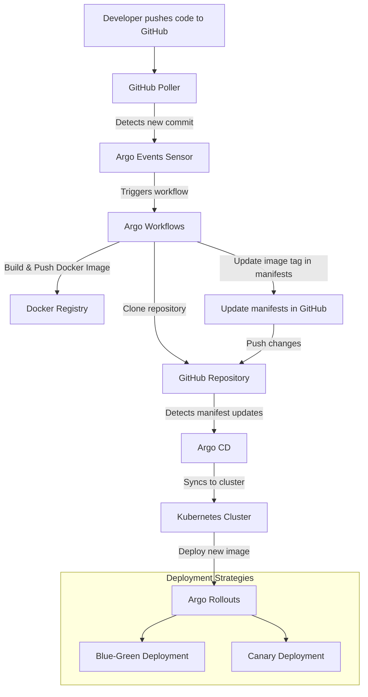

# Argo GitOps Blue-Green Deployment with Progressive Delivery Strategies

[](https://github.com/mtyiska/argo_gitops_blue_green)
[](https://argoproj.github.io/cd)
[](LICENSE)

## Overview

In this repository, we demonstrate how to automate CI/CD pipelines for Kubernetes deployments using GitOps principles and progressive delivery strategies like **blue-green** and **canary rollouts**. This approach ensures reliable, scalable, and automated workflows, leveraging **Argo Rollouts**, **Argo CD**, **Argo Workflows**, and **Argo Events**.

### Key Features:
- **GitOps Automation**: Treat your Git repository as the single source of truth for deployments.
- **Blue-Green & Canary Rollouts**: Enable seamless and safe deployment strategies.
- **Event-Driven CI/CD**: Automate builds and deployments based on GitHub commits.
- **Real-Time Monitoring**: Monitor application health and rollback automatically when issues arise.

---

## Architecture Diagram



---

## Tools Used

1. **Argo Rollouts**: Progressive delivery strategies like blue-green and canary rollouts.
2. **Argo CD**: Automates Kubernetes deployments from Git repositories.
3. **Argo Workflows & Events**: Event-driven automation triggered by GitHub commits.
4. **Kind**: Local multi-node Kubernetes clusters for testing.
5. **NGINX Ingress Controller**: Traffic management for staging and production environments.
6. **Docker**: Building and pushing container images.

---

## Setup Guide

### Pre-requisites
1. Docker installed on your system.
2. Kubernetes CLI (`kubectl`) installed.
3. Access to a Docker Registry.
4. Install Kind for local Kubernetes clusters:
   ```bash
   brew install kind
   ```

### Step 1: Create a Local Kubernetes Cluster
```bash
kind create cluster --name argo-cluster --config kind-config.yaml
kubectl get nodes
```

### Step 2: Install NGINX Ingress Controller
```bash
helm upgrade --install ingress-nginx ingress-nginx \
  --repo https://kubernetes.github.io/ingress-nginx \
  --namespace ingress-nginx --create-namespace
```

### Step 3: Set Up Argo Rollouts
```bash
kubectl create namespace argo-rollouts
curl -L -o argo-controller.yaml https://github.com/argoproj/argo-rollouts/releases/latest/download/install.yaml
kubectl apply -n argo-rollouts -f argo-controller.yaml
kubectl argo rollouts version
```

### Step 4: Deploy Applications
- **Blue-Green Deployment**: Deploy the staging environment with a blue-green strategy.
   ```bash
   kubectl apply -k staging/
   ```
- **Canary Deployment**: Deploy the production environment with a canary strategy.
   ```bash
   kubectl apply -k production/
   ```

---

## Benefits of this Approach

- **Reliability**: Reduce downtime with progressive delivery strategies.
- **Scalability**: Seamlessly handle deployment complexity with GitOps principles.
- **Automation**: Eliminate manual errors and focus on innovation.

---

## Repository Structure

```
📁 infra/
   ├── argocd/               # Argo CD configurations
   ├── argo-rollouts/        # Rollout strategies for staging and production
   ├── argo-events/          # Event source and sensor configurations
   └── pipelines/            # Workflow templates for CI/CD
📁 apps/
   └── node-demo/            # Node.js API application
```

---

## Getting Started

1. Clone the repository:
   ```bash
   git clone https://github.com/mtyiska/argo_gitops_blue_green
   cd argo_gitops_blue_green
   ```

2. Follow the [Setup Guide](#setup-guide) to configure the environment.

3. Trigger a deployment:
   - Make a code change and push it to GitHub.
   - Watch the pipeline automate everything from build to deployment.

---

## Learn More

- 📖 Blog: [Automating CI/CD Pipelines for Kubernetes](https://dev.to/michael_tyiska/automating-cicd-pipelines-for-kubernetes-with-argo-rollouts-argo-cd-argo-workflow-events-1l3f)
- 🎥 YouTube: [Watch the Video Walkthrough](https://www.youtube.com/watch?v=Mcm4QKzqpGA)
- 💡 LinkedIn: [Discussion on CI/CD Best Practices](https://www.linkedin.com/pulse/automating-cicd-pipelines-kubernetes-step-by-step-guide-tyiska-udokc/?trackingId=7LRPb%2FWSREON9C0pMUia%2Fw%3D%3D)

---

## Contributing

Found something interesting or want to enhance the project? Open an issue or submit a pull request. Contributions are welcome!

---

## License

This project is licensed under the MIT License - see the [LICENSE](LICENSE) file for details.
