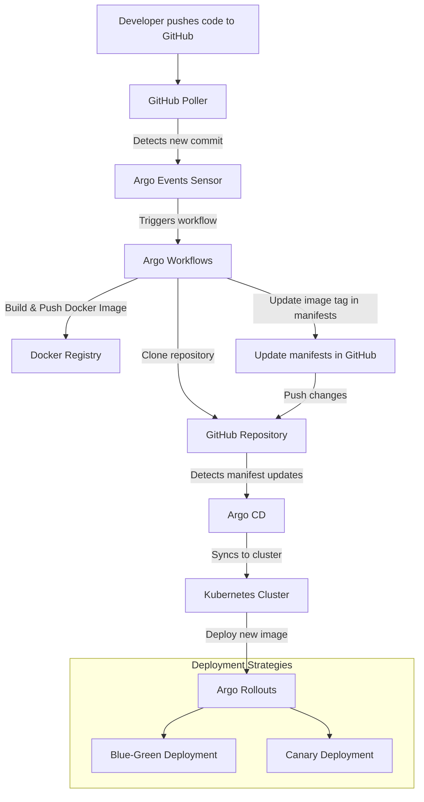

# argo_gitops_blue_green

```mermaid
flowchart TD
    AppChange[Developer pushes code to GitHub] --> GHP[GitHub Poller]
    GHP -->|Detects new commit| AES[Argo Events Sensor]
    AES -->|Triggers workflow| WF[Argo Workflows]
    WF -->|Clone repository| REPO[GitHub Repository]
    WF -->|Build & Push Docker Image| DockerRegistry[Docker Registry]
    WF -->|Update image tag in manifests| GitUpdate[Update manifests in GitHub]
    GitUpdate -->|Push changes| REPO
    REPO -->|Detects manifest updates| ACD[Argo CD]
    ACD -->|Syncs to cluster| K8S[Kubernetes Cluster]
    K8S -->|Deploy new image| AR[Argo Rollouts]
    subgraph RolloutStrategies[Deployment Strategies]
        AR --> BG[Blue-Green Deployment]
        AR --> CR[Canary Deployment]
    end

```